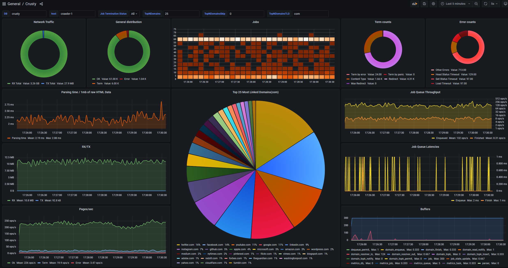

# Crusty - polite && scalable broad web crawler

## Introduction
Broad web crawling is an activity of going through practically boundless web by starting from a set of locations(urls) and following outgoing links

It presents a unique set of challenges one must overcome to get a stable and scalable system, `Crusty` is an attempt to tackle on some of those challenges to see what's out here

This particular implementation could be used to quickly fetch a subset of all observable internet in a scalable and stable manner

Built on top of [crusty-core](https://github.com/let4be/crusty-core) - which handles all low-level aspects of web-crawling

## Key features 
- Configurability && extensibility
  
  see a typical [config file](config.yaml) with some explanations
  
- Blazing fast single node performance
  
  Crusty is written in rust on top of green threads running on [tokio](https://github.com/tokio-rs/tokio), so it can achieve quite impressive single-node performance even on a moderate PC
  
  Additional optimizations are possible to further improve this(channels, better html parsing depending on task requirements)
  
  Additionally, Crusty has small and predictable memory footprint and is usually cpu/network bound
  
- Scalability
  
  Each Crusty node is essentially an independent crawling unit, and we can run hundreds of them in parallel, 
  the tricky part is job delegation and domain discovery which is solved by a high performance sharded queue-like structure built on top of clickhouse.
  
- Basic politeness
  
  While we can crawl thousands of domains in parallel - we should absolutely limit concurrency on per-domain level
  to avoid any stress to crawled sites, see `job_reader.default_crawler_settings.concurrency`.
  It's also a good practice to introduce delays between visiting pages, see `job_reader.default_crawler_settings.delay`.
  
  Additionally, there are massive sites with millions of sub-domains(usually blogs) such as tumblr.com.
  Special care should be taken when crawling them, as such we implement a sub-domain concurrency limitation as well, see `job_reader.domain_tail_top_n` setting which defaults to 3 - no more than 3 sub-domains can be crawled concurrently
  
  Currently, there's no `robots.txt` support but this can be added easily(and will be)
  
- Observability
  
  Crusty uses [tracing](https://github.com/tokio-rs/tracing) and stores multiple metrics in 
[clickhouse](https://github.com/ClickHouse/ClickHouse) 
that we can observe with [grafana](https://github.com/grafana/grafana) - giving a real-time insight in crawling performance

## Getting started

- building

there is a Dockerfile for easier building and distribution: `docker build -f ./infra/Dockerfile -t crusty .`
(supports incremental builds)

- external service dependencies - clickhouse and grafana

for now see [those notes](./infra/docker.txt), docker compose is coming a bit later

to create / clean db use [this script](./infra/clean-clickhouse.sh)

grafana dashboard is exported as [json model](./infra/grafana.json)

## Contributing

I'm open to discussions/contributions, use github issues, pull requests are welcomed ;)